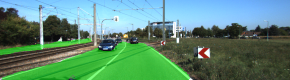
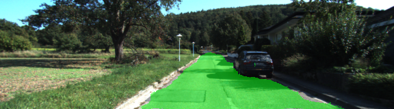
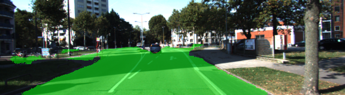

# Term3 - Project 2: Semantic Segmentation
### Ajay Paidi

# Objective
The objective of this project is to train a Fully Convolutional Neural Net that can distinguish between road pixels and non-road pixels.

# File structure
- **ReadMe.md**: This file
- **Semantic_Segmentation.ipynb**: The main ipython notebookk that contains the implementation and training details.
- **main.py**: The above ipython notebook in python script form.
- **helper.py**: Contains some helper functions
- **project_tests.py**: Unit tests

# Description

Fully convolutional networks represent the current state of art in performing sementation tasks. They typically consist of 3 parts. An encoder and a decoder.
1. An encoder.
2. A decoder.
3. Skipped connections.

### Encoder
An encoder is generally speaking a CNN. The main difference is the dense (fully connected) layers of the CNN are replaced by 1x1 convolutional layers. This results in the final layers having dimensions (N,Height,Width,Chanells) instead of (N,1). By doing this, the encoder serves to preserve the spatial information of the input samples which otherwise tend to get lost during th conversion to dense layers in a typical CNN. For this project I used a pre-trained VGG network as my encoder.

### Decoder
A decoder can be thought of as a reverse CNN that makes use of a special technique called transposed convolutions. When the CNN architecture is 'reversed' the convolution and pooling layers now have the effect of 'upsampling' the input images instead of 'downsampling'. This is achieved using the technique of transposed convolutions where the output from a single pixel is 'transpose convolved' into a bigger neighborhood of pixels. The output of the decoder is then reshaped (1 X num_classes). In my imlementation, I then feed the decoder output to a softmax function (to compute probabilities for each class) which then gets fed to the loss function (cross entropy loss).

### Skipped connections
Skipped connections imply connecting the output of one convolutional layer in the encoder to another non-adjacent convolutional layer in the decoder using an element wise add operation. This allows the network to use information from multiple resolutions enabling more accurate predictions.

The following diagram (taken from reference 1) is a description of the implemented FCN using VGG16.

In addition to the above implementation, an additional data augmentation technique was implemented to perform histogram equalization on the input images. This has the effect of compensating for the variations in lightings in the input data.

# Results

The neural network was trained over 35 epochs. Mean IOU was used as the accuracy metric and computed after every epoch.  At the end of 35 epochs the training and validation accuracy was about 84%. Attached are a few images showing the inference results on the test data.

# References
1. Fully convolutional networks for semantic segmentation. J.Long, E.Shelhamer, T.Darrell.
2. Starter code provided by Udacity and videos/lecture notes.
